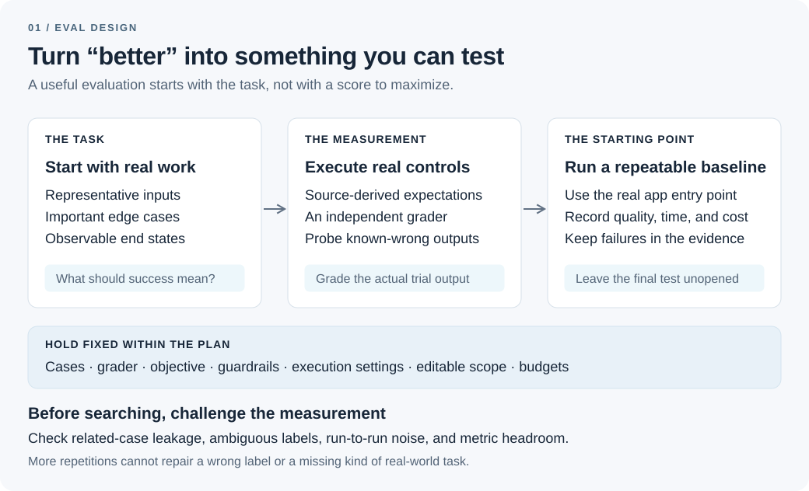
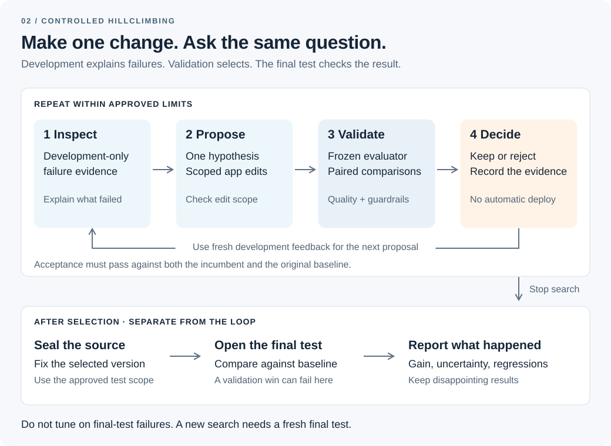

# Codex Eval Lab

**Automating eval design and hillclimbing with Codex**

Improving an application takes two kinds of work: deciding how to measure success, and finding changes that improve that measurement on new examples. Codex Eval Lab brings both into your codebase. Four Codex skills help you design an evaluation, audit the measurement, improve the application, and explain the result. An execution engine keeps the cases and grader fixed, tests proposed changes, and records why each candidate was accepted or rejected.

The goal is a reviewable change supported by evidence. The search can edit prompts, skills, tool descriptions, model parameters, or application code within the approved files. That might produce a more reliable agent, a cheaper configuration, or a faster implementation. Your application keeps its existing language, provider, and runner.

**0.1.0 alpha · Python 3.11+ · no third-party core runtime dependencies · [MIT](LICENSE)**

## Start with a measurement you can trust

An evaluation makes a product judgment executable. Before optimizing a ticket router, for example, you need to decide what “correct” means when a customer asks about both a missing package and a refund. A bigger dataset will not resolve an undefined routing policy.

The lab's design workflow focuses on three questions.

### Are you measuring the right work?

Start with the tasks the application actually needs to handle. Include ordinary requests as well as difficult ones, and cases where the correct behavior is to do nothing. Production examples, bug reports, and hand-written cases can each reveal a different part of the problem.

Keep their origins visible. A synthetic stress test can expose a weakness without telling you how frequently that weakness occurs. Likewise, ten variations of one conversation are not ten independent observations. The suite supports related-case groups so that versions of the same underlying task stay together when the data are split.

### Would you agree with the grader?

For a router, the grader can compare a returned category with an approved label. For a coding agent, it can run tests against the resulting files. For an open-ended answer, it may need a rubric and an independently configured model judge.

In each case, inspect a pilot: the input, the application's actual output, the verdict, and the reason. Include incorrect and partial answers, not just convincing successes. The optional [judge tools](examples/judges) include a structured rubric adapter and a human/judge agreement checker; domain judgment still determines whether the rubric captures useful behavior.

The application and grader are separate. An agent saying it completed a task is evidence to inspect, not the definition of success.

### Can you detect a change worth making?

A one-point improvement is hard to interpret if an unchanged application moves five points between runs. Repeating cases helps reveal instability; adding independent cases broadens the work being measured. Those solve different problems.

Decide how much improvement would justify a change, then check the baseline's noise and remaining headroom. Sometimes the next useful experiment targets cost or latency while preserving quality. Sometimes the measurement needs work before optimization makes sense.



*Figure 1. Build the measurement first: review the cases, calibrate the grader, and establish a baseline before searching for improvements.*

## Build and audit an evaluation

`$build-eval` guides Codex through those decisions inside your project. It starts by inspecting the real entry point and existing tests, then proposes cases, grading rules, and a runnable suite. You review the examples and labels, the grader's pilot results, and the execution plan separately.

The resulting suite contains versioned cases, configuration, a thin application adapter, an independent grader, and any declared fixtures. The adapter boundary is deliberately small: one JSON request in, one JSON response out. That lets the lab wrap a Node application, a Python agent, or an existing executable without rebuilding it around a new framework.

`$audit-eval` challenges the setup before you spend search rounds on it. Are related cases leaking across splits? Does the configured model reach the actual application? Are timeouts being mistaken for task failures? Would a known-bad answer receive a bad grade?

Some checks are mechanical; others require reading examples and understanding the domain. The engine's structural audit complements that review. It cannot establish that a label is true or that the dataset represents your users.

Once approved, the engine snapshots the evaluator and records the baseline. If the grader later turns out to be wrong, fix it in a new approved experiment and establish a new baseline. Otherwise, changing the measurement can look deceptively like improving the application.

## Give the search a specific job

Hillclimbing is a sequence of small experiments: diagnose a failure, propose a change, measure it, and retain it only when it meets the agreed criteria.

A useful assignment connects an editable surface to an observable outcome. “Improve this agent” leaves too many moving parts. “Improve routing accuracy by editing the routing prompt and parser, while preserving the cost and latency limits” gives the search a boundary and gives you an interpretable result.

The objective can also be a reduction. A cheaper configuration is valuable only if the answers remain good enough; a faster algorithm is valuable only if it remains correct. The lab expresses that as one primary metric plus guardrails, with explicit tolerances.

### Separate learning, selection, and confirmation

A search can gradually adapt to the examples used to judge it. Even without copying answers, repeated selection rewards changes that suit that particular collection of cases.

Codex Eval Lab gives the data three distinct roles:

- **Development (`train`):** examples and failure evidence the optimizer may inspect
- **Validation:** comparisons used by the controller to select candidates
- **Final test:** a separate comparison after the selected source version is sealed

The optimizer receives development evidence only. Validation still shapes which candidate survives, so its score is a search result rather than independent confirmation. The final test asks whether the selected change holds up on the reserved cases.

This separation needs an appropriate execution environment. Local mode is for trusted code and cooperative agents; a different directory or read-only proposal session does not hide files from the same OS user. For genuinely private holdouts, the lab supports development-workspace export and proposal import across a separately provisioned trust boundary. Docker mode isolates application execution, not the local optimizer. The [security guide](docs/SECURITY.md) explains those deployment choices.



*Figure 2. Development explains failures, validation selects changes, and the final test checks the selected result. The evaluator remains fixed throughout the search.*

## Run the loop, then explain the result

`$hillclimb` starts with the approved objective, editable files, guardrails, and limits. In the automatic workflow, the controller launches fresh Codex proposal sessions with source and development evidence. Each proposal explains a hypothesis and supplies structured file edits.

**The model proposes; the controller applies and measures.** It validates edit scope, creates a candidate snapshot, and runs the fixed evaluation. You can also register candidates manually or use a custom optimizer through the same protocol.

A candidate must pass comparisons against both the current selection and the original baseline. That second check matters: a sequence of individually tolerated regressions should not quietly accumulate into a large loss. Comparisons require complete paired trials, with uncertainty estimated by resampling related-case groups after averaging repetitions within each case. The [statistics reference](docs/STATISTICS.md) explains the selection gates and their limits.

Rejected candidates remain in the record. So do timeouts, malformed outputs, and attempts whose outcomes are unknown. They are not silently discarded or rerun until the score looks better. Durable experiment state makes it possible to inspect an interrupted run and resume eligible work without repeating completed trials.

Spending is part of the plan. Evaluation reservations cover application and grader calls, including adapter-reported retries; they depend on conservative, honest cost reporting and cannot enforce a provider-side hard cap. Codex or custom-optimizer usage is separate, with its own call and time limits. Unknown optimizer charges are never presented as zero.

After selection, you approve opening the final test. `$report-eval` helps explain the chosen change, its final comparison with the baseline, uncertainty, regressions, failures, and costs. The self-contained HTML report loads no external resources. Exporting the selected source creates a new review directory rather than overwriting your working tree or deploying it.

A failed final comparison is a useful result, too. It tells you the selected change has not earned the conclusion you hoped for. Further tuning needs a fresh final test.

## What the included experiments show

The repository includes two reproducible offline studies. Both use synthetic data and hand-authored changes. They exercise the evaluation machinery; neither is a live Codex performance benchmark.

### Keeping a useful change and rejecting harmful ones

The [routing study](examples/routing) starts with a keyword router that misses uppercase messages. Its first scripted proposal normalizes the input's case before applying the existing rules. Two subsequent proposals deliberately damage the routing behavior.

The controller retains normalization and rejects both harmful candidates. On the 20 final synthetic cases, accuracy moves from **70% to 100%**. The complete experiment runs **560 application-plus-grader trials** across 80 cases, with two repetitions per case and **$0 evaluation cost**.

The useful evidence is the whole decision trail: the same grader measures each version, harmful changes fail selection, and the selected source reaches final confirmation. The public fixture demonstrates that lifecycle rather than improvement on real customer traffic. Inspect the [recorded results](docs/validation/routing-demo.json) and [sample report](docs/sample-report.html).

### Optimizing speed while preserving correctness

The [software benchmark](examples/benchmark) replaces repeated membership scanning with ordered hash deduplication. Across 120 trials, the recorded final case-averaged median kernel timing falls from approximately **1.097 ms to 0.024 ms**, while all measured correctness checks remain passing.

That illustrates a minimization objective with a correctness guardrail. The change was hand-authored and the cooperative test code reports its own kernel timing; this is neither a Codex-discovered speedup nor an end-to-end application-latency result. Untrusted candidates require independent timing. See the [benchmark record](docs/validation/benchmark-demo.json).

## Getting started

Install the engine and user-level skills from the repository:

```sh
git clone https://github.com/trevordcampbell/codex-eval-lab.git
cd codex-eval-lab
python -m pip install -e .
python scripts/install_skills.py --scope user
```

Open your application in Codex and start with a concrete flow:

```text
$build-eval Build an evaluation for our support-ticket router. Reuse our existing
runner and provider. Help me review cases, calibrate the grader, and establish
a baseline before optimizing.
```

Then use `$audit-eval` to review the measurement, `$hillclimb` to search within an approved plan, and `$report-eval` to explain the evidence. Skill availability depends on your Codex client; refresh or restart it after installation if needed. The [operating guide](docs/OPERATING_GUIDE.md) covers approval commands, budgets, manual candidates, and recovery.

To try the entire offline loop first:

```sh
python scripts/demo.py --out ../eval-lab-offline-demo
```

Choose a new output directory outside the repository, then open its `report.html`. This scripted demonstration needs no API key, Codex installation, network access, or paid calls. For actual Codex proposals, [install and authenticate the Codex CLI](https://developers.openai.com/codex/cli), then run `python scripts/prepare_codex_demo.py --out ../eval-lab-codex-suite` to prepare a new, unapproved suite. Follow the [operating guide](docs/OPERATING_GUIDE.md) for review and execution.

### Project status and further reading

The current automated suite passes **186 tests**, including simulated Codex and provider integrations and release-packaging checks. Authenticated live Codex runs, live provider judging, and actual Docker execution remain unverified. Read the [validation record](docs/VALIDATION.md) before relying on those integrations.

- [Operating guide](docs/OPERATING_GUIDE.md): design, approval, execution, and recovery
- [Protocol](docs/PROTOCOL.md): adapters, assets, metrics, and configuration
- [Statistics](docs/STATISTICS.md) and [security](docs/SECURITY.md): interpreting results and choosing isolation
- [Capabilities and roadmap](docs/CAPABILITIES.md), [contributing](CONTRIBUTING.md), and [changelog](CHANGELOG.md)

## Inspiration

This independent project was inspired by Lance Martin's [Automating eval design and hillclimbing with Claude](https://claude.dev/blog/automating-eval-design-and-hillclimbing/). It implements its own Codex skills, controller, adapters, and experiment lifecycle; no Anthropic source files are vendored. It is not an official OpenAI or Anthropic product.
